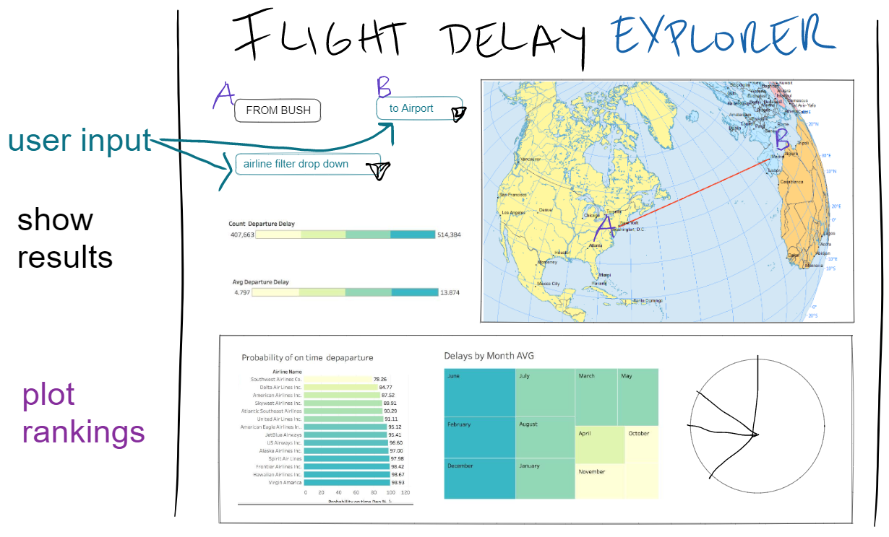

# Flight Delay Explorer

> team: armine, ryan, maura, alberto

### objective 

Explore and compare the departure delay statistics for commercial airlines departing from IAH

Users will use the explorer to determine which airline has the least likelihood of getting delayed
as well as the travel path to Houston that has the least likelihood of delay.

### data sources

Bureau of Transportation Statistics 

> https://www.transtats.bts.gov/OT_Delay/OT_DelayCause1.asp?20=E
>
> https://www.transtats.bts.gov/ontime/departures.aspx
>
> https://www.transtats.bts.gov/DL_SelectFields.aspx?gnoyr_VQ=FGJ&QO_fu146_anzr=b0-gvzr

Geoapify (for airport coordinates) 

### inspiration 

### pre-operational database ETL information

preparing the datasets, exploring through the available information. some considerations: 
- years 
- level of aggregation 
- geographical region 

The team's current direction is to tackle: 
1. All carriers from AIH with outgoing flights 

Subregion: Texas 
Flight type: Intl & domestic

